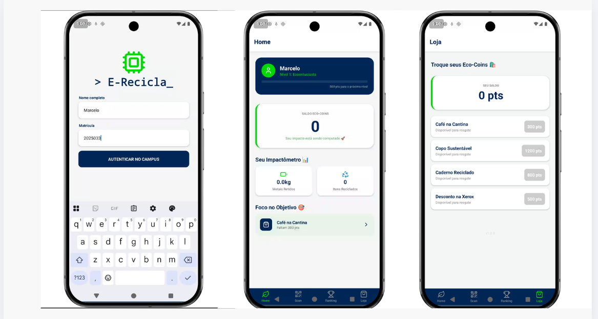
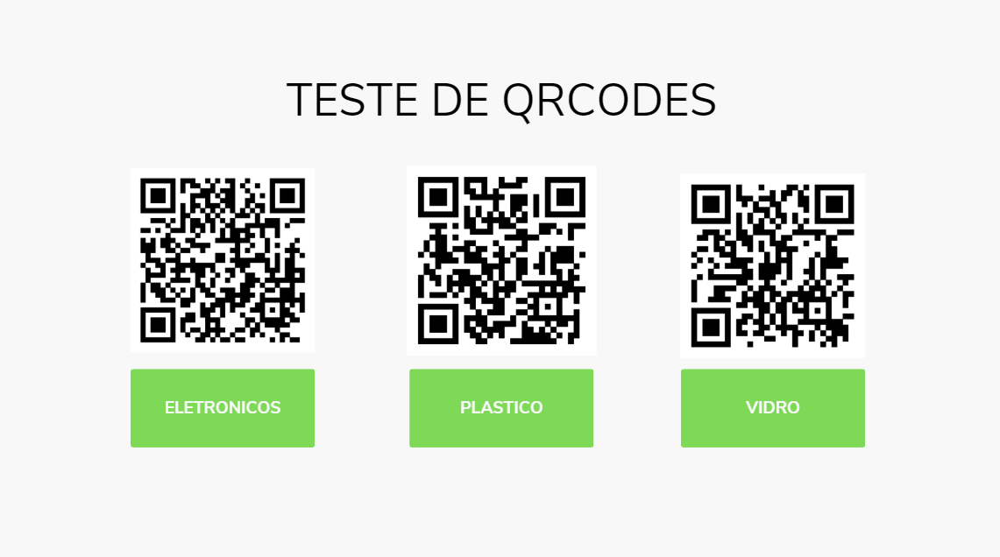

# ♻️ E-Recicla

O **E-Recicla** é um aplicativo mobile desenvolvido para incentivar e gamificar o descarte correto de resíduos sólidos e lixo eletrônico no campus da faculdade Estácio, em Osasco.

## 📱 Telas do Aplicativo

## 🚀 Funcionalidades

* **Autenticação Simples:** Acesso rápido utilizando nome e número de matrícula para rastrear o progresso do aluno.
* **Scanner de QR Code:** Leitura de códigos afixados nos ecopontos da instituição para registrar e validar o descarte de materiais.
* **Sistema de Recompensas (Eco-Coins):** Acúmulo de pontuação variável com base no tipo de resíduo (ex: eletrônicos, plástico, vidro, papel).
* **Impactômetro:** Acompanhamento em tempo real do impacto ambiental individual, medindo a quantidade de metais retidos (kg) e o total de itens reciclados.
* **Loja de Resgates:** Troca de Eco-Coins por benefícios reais no campus, como "Café na Cantina", "Copo Sustentável" ou "Desconto na Xerox".
* **Progressão de Nível:** Sistema de gamificação que eleva o status do usuário, começando como "Ecoentusiasta" e progredindo até "Oráculo Sustentável".

## 🧪 Simulador de Ecopontos (QR Codes)

Para testar a funcionalidade de scanner via câmera do aplicativo, direcione o leitor para os QR Codes abaixo, que representam as lixeiras seletivas físicas:

## 🛠️ Tecnologias e Ferramentas

* **[React Native](https://reactnative.dev/)** & **[Expo](https://expo.dev/):** Desenvolvimento de interface multiplataforma nativa (Android e iOS).
* **Context API (React):** Gerenciamento de estado global para distribuição instantânea das informações do perfil e saldo do usuário.
* **AsyncStorage:** Persistência de dados em chave-valor (JSON) diretamente no armazenamento local do dispositivo (offline-first).
* **Expo Camera:** Módulo de integração com o hardware da câmera para leitura e decodificação de códigos QR.
* **Lucide React Native:** Implementação de iconografia moderna e leve para a navegação.

## 👨‍💻 Autor

Desenvolvido por **Marcelo Sanches** *Sistemas de Informação - Estácio*
